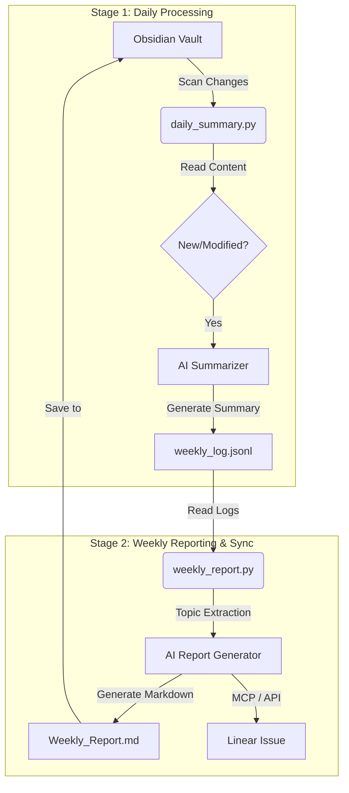

# Obsidian AI Weekly: 无感自动【知识增长】汇报PoC

## 1. 项目愿景与方法论 (Vision & Methodology)

本周报生成器，是一次关于 **"无感自动知识增长 (Imperceptible Automatic Project Management)"** 的 AI 解决方案MVP。

**思路：**
> **知识库 (Knowledge Base) -> LLM 分析 + 中转 -> 进度跟进中台 (Progress Tracking Middleware)**

我们认为，项目管理不应是额外的人工负担，而应是知识产出的自然副产品。通过 AI 分析知识库中的自然产出（笔记、文档），自动提炼工作重心与进度，并同步至专业的项目管理工具。

**测试目标：**
*   验证 **Obsidian (知识库)** -> **LLM (智能分析)** -> **Linear (项目管理平台)** 的端到端数据流。
*   探索未来不局限于特定工具（如不仅限于 Obsidian 或 Linear）的通用自动化协作范式。

## 2. 核心数据流 (Data Flow)

本项目的核心逻辑链条如下：
**`Obsidian Note` -> `LLM Summary` -> `Weekly Report` -> `Linear Issue`**

1.  **无感采集**: 用户仅需在 Obsidian 中专注于记笔记、写文档。
2.  **增量摘要**: 系统每日/实时扫描变更，利用 LLM 生成简短摘要，避免上下文超载。
3.  **周报生成**: 周末基于摘要聚合生成周报，提炼工作重心。
4.  **自动同步**: 将生成的周报自动发布到 Linear (或其他中台)，完成进度的闭环。

## 3. 方案架构

### 架构：两阶段处理 (Two-Stage Architecture)

为了解决 Context Window 上下文超载问题，并实现模块化解耦：

1. **Stage 1: 日增摘要 (Daily/Real-time)**
   - **输入**: Obsidian Vault 中的新增/修改文件。
   - **处理**: `daily_summary.py` 扫描变更 -> 调用 AI 生成单篇摘要。
   - **输出**: 结构化日志 `weekly_log.jsonl`。
   - **优势**: 将海量原文压缩为高密度摘要，大幅降低 Token 消耗。

2. **Stage 2: 周报生成与分发 (Weekly Reporting & Distribution)**
   - **输入**: `weekly_log.jsonl` 摘要日志。
   - **处理**: `weekly_report.py` 聚合摘要 -> 识别主要话题 (Topics) -> 生成 Markdown 周报。
   - **分发**: 调用 Linear MCP 将报告同步为 Linear Issue。

### 数据流图 (Data Flow Diagram)



## 4. 快速开始 (Quick Start)

### 一键运行流水线 (Pipeline)
我们提供了一个流水线脚本，自动执行扫描、生成和发布全流程。

```bash
# 扫描 test_vault，生成周报，并发布到 Linear
python run_pipeline.py --vault "../test_vault" --days 7 --publish-linear
```

### 分步运行

**1. 运行每日扫描 (Daily Summary)**
```bash
python daily_summary.py --vault "../test_vault"
```

**2. 运行周报生成并发布 (Weekly Report)**
```bash
# 生成本地报告并发布到 Linear (需配置 LINEAR_API_KEY)
python weekly_report.py --output "." --publish-linear
```

## 5. 配置说明 (Configuration)

本项目使用 `.env` 文件来管理敏感配置。请在项目根目录 (`obsidian-ai-weekly/`) 创建 `.env` 文件（参考 `.env.example`）：

```ini
# .env file
# Linear API Key (User Level)
# 如果使用 Jira/Trello，请替换为相应的 API Key 或 Token
LINEAR_API_KEY=your_linear_api_key_here
```

*   **LINEAR_API_KEY**: 你的 Linear 个人 API Key，用于发布 Issue。
    *   *Note: 本项目演示了 Linear 的集成，但你可以轻松替换为 Jira、Trello 或 GitHub Issues 的 API。*
*   **Vault Path**: 运行脚本时通过 `--vault` 参数指定。
    *   *Note: 虽然默认扫描 Obsidian (.md) 文件，但此逻辑适用于任何基于文本的知识库 (Notion Export, Logseq, VS Code Notes)。*


